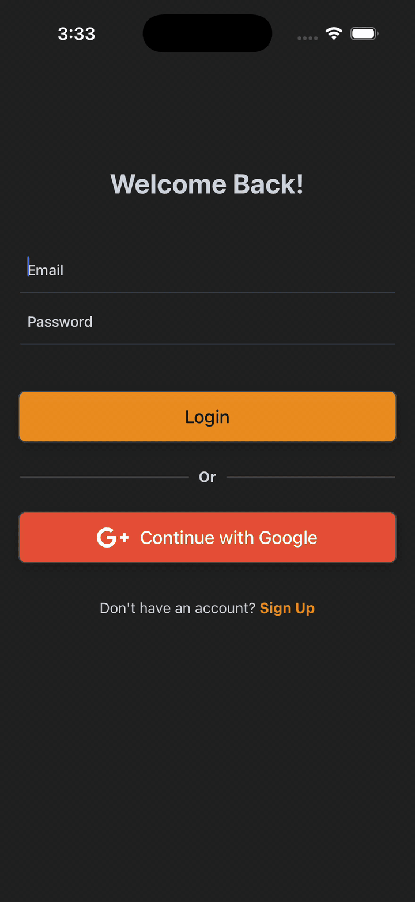

# 📝 Todo App — React Native + AWS Amplify

A clean, modern **Todo application** built with **React Native CLI**, **NativeWind (Tailwind CSS)**, and **AWS Amplify**, showcasing production-ready theming, authentication, and cloud-backed data handling.

This project is designed to demonstrate:

* Thoughtful **UI/UX** decisions
* Proper **dark / light mode** implementation
* Secure **OAuth authentication**
* Cloud-native **GraphQL CRUD operations**
* Clean **architecture & theming** patterns
* Attention to **platform differences** (iOS vs Android)

---

## ✨ Features

* ✅ Create, update & delete todos (GraphQL)
* 🔐 Authentication with **AWS Amplify Auth**

  * Google OAuth
  * Secure user sessions
* 🌗 Light / Dark mode (system + manual toggle)
* 🎨 Tailwind-aware custom color palette
* 🧩 Global theme provider (single source of truth)
* 🧊 Glass-style UI with platform-correct shadows
* ☁️ Cloud-backed data persistence (AWS AppSync)
* 📱 Optimized for both **Android** and **iOS**

---

## 📱 UI Preview

<table>
  <tr>
    <th>### 🌙 Dark Mode</th>
    <th>### ☀️ Light Mode</th>
  </tr>
  <tr>
    <td>
      
    </td>
    <td>
      
    </td>
  </tr>
</table>

---

## 🎥 Full App Walkthrough

<table>
  <tr>
    <th>Normal Login</th>
    <th>Google OAuth (AWS-Amplify)</th>
  </tr>
  <tr>
    <td>
      <video src="./src/assets/demo/app-demo-NormalAuth.mp4" width="320" controls muted></video>
    </td>
    <td>
      <video src="./src/assets/demo/app-demo-GoogleAuth.mp4" width="320" controls muted></video>
    </td>
  </tr>
</table>


---

## 🛠️ Tech Stack

### Frontend

* **React Native CLI**
* **TypeScript**
* **NativeWind (Tailwind CSS)**
* **Context API** (auth & theming)
* **React Navigation**

### Backend / Cloud

* **AWS Amplify**
* **Amazon Cognito** (Authentication)
* **Google OAuth**
* **AWS AppSync** (GraphQL API)
* **DynamoDB** (data persistence)

---

## 🧠 Architecture Highlights

* **AWS Amplify–driven authentication**

  * OAuth sign-in with Google
  * Secure token & session handling

* **GraphQL-first data layer**

  * Typed queries & mutations
  * Real-time-ready schema design

* **Global Theme Provider**

  * Centralized theme state
  * Syncs with NativeWind (`dark` class)

* **Tailwind-aware Design Tokens**

  * Custom color palette
  * Consistent styling across components

* **Platform-correct UI handling**

  * Android elevation vs iOS shadows
  * SafeArea-aware status bar styling

---

## 🚀 Getting Started

### Prerequisites

* Node.js (LTS)
* React Native CLI environment
* AWS Account (for Amplify backend)

Make sure you have completed:
👉 [https://reactnative.dev/docs/set-up-your-environment](https://reactnative.dev/docs/set-up-your-environment)

---

### 1️⃣ Install dependencies

```sh
npm install
# or
yarn install
```

---

### 2️⃣ Configure AWS Amplify

```sh
amplify pull
```

> This app uses an existing Amplify backend (Auth + GraphQL).

---

### 3️⃣ Start Metro

```sh
npm start
# or
yarn start
```

---

### 4️⃣ Run the app

#### Android

```sh
npm run android
# or
yarn android
```

#### iOS

```sh
bundle install
bundle exec pod install
npm run ios
# or
yarn ios
```

---

## 📂 Project Focus

This repository is intentionally focused on:

* End-to-end **mobile + cloud integration**
* Secure authentication flows
* Clean theming & UI polish
* Scalable architecture patterns

It is meant as a **portfolio project** demonstrating real-world React Native and AWS Amplify usage.

---

## 📌 Notes for Reviewers

* Authentication handled via **AWS Cognito (Amplify Auth)**
* GraphQL CRUD via **AWS AppSync**
* Emulator recommended: **Pixel 2 / 3 — 4GB RAM, 32GB storage**
* Android & iOS behaviors are handled intentionally

---

## 📄 License

This project is open-source and available for educational and demonstration purposes.

---